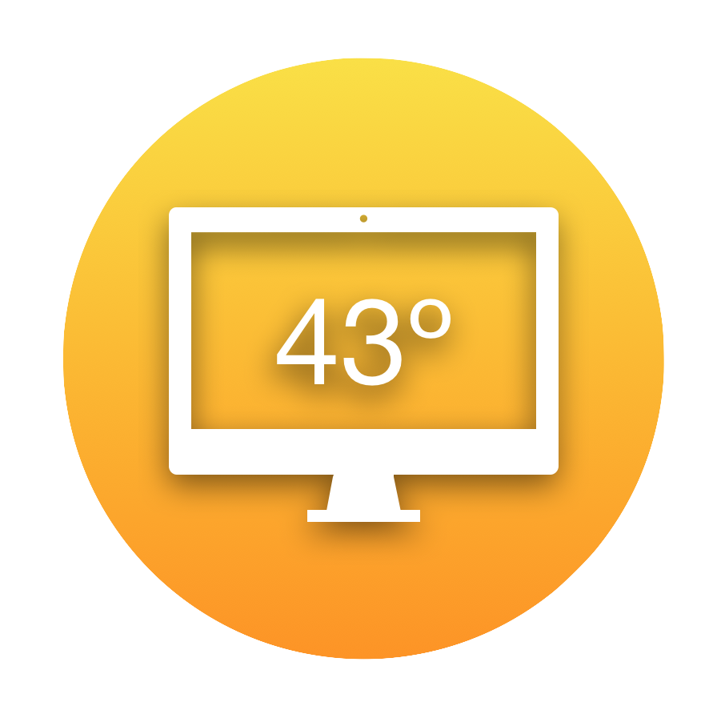

# LAN Weather

Local weather service that runs on Linux and provides data for a user to see in an Android app.

## Introduction

This project allows a user to setup a personal weather service in one location. All of the weather information is displayed in a connected Android app. The personal weather service will also provide clothing recommendations (based on the user's preferences) to easily decide what to wear today.

## Features

1. Check Current Weather
2. Check Weather Forecast
3. Set Preferences
4. Receive Notications
5. Get Clothing Recommendations

## Getting Started

### Installation and Setup

#### Weather Service

Run on a Linux based system.

- [Rust](https://www.rust-lang.org/tools/install)
- [libzmq](https://github.com/zeromq/libzmq#installation-of-binary-packages-)

```bash
make build-release-lib
sudo make install-lib
make build-release
```

This set of steps firsts builds the Rust dynamic library for talking to the NWS API with release flags, installs it to `/usr/lib/`, builds the lanweatherd daemon with release flags linked to the installed library, then installs the daemon binary in `/usr/sbin` and registers it with systemd. **This will automatically start the weather service.**
`sudo` is needed for the install steps.

#### Temperature Sensor

Run on a Linux based system.

The Arduino code must be flashed to the Arduino using the Arduino app. When flashing the code you must follow these steps to properly include the Si7021 library from Adafruit.

1. Open the .ino file with the Arduino editor
2. Select "Sketch" -> "Include Library" -> Manage Libraries...
3. Type "Si7021" into the search bar
4. Select the "Install" option on the "Adafruit Si7021 Library" result
5. Flash the Arduino with the temp sensor code

#### App

- [Android Studio](https://developer.android.com/studio)

Install Android Studio and configure an emulator. This project supports Android 7.0 and higher, so make sure to pick an emulator that is at least Android 7.0.

### Run

#### Start Weather Service

If the service is killed (like in htop) systemd should restart it. If you stop it with ```sudo systemctl stop lanweatherd```, then to restart it run ```sudo systemctl start lanweatherd```.

#### Start Temperature Sensor

Plug the temperature sensor into the USB port of your computer.

#### Start App

Open the androidapp folder in Android Studio and click the run button (looks like a play button) at the top right of the window.

## Demo Video

This shows how to setup the project and a walklthrough of the app.

<https://youtu.be/Q5loPWBkcJQ>

## Contributors

- Tom Castle, Team Lead & Weather Service Engineer
- Ryan Bebb, UI Designer & Android App Engineer
- Brian Hurley, Sensor & Remote Service Engineer
- Eli Labell, Database Administrator & Android App Engineer


